基于SpringBoot的足球社区管理系统（程序+论文）
=
- 完整代码获取地址：从戎源码网 ([https://armycodes.com/](https://armycodes.com/))
- 作者微信：19941326836  QQ：952045282 
- 承接计算机毕业设计、Java毕业设计、Python毕业设计、深度学习、机器学习
- 选题+开题报告+任务书+程序定制+安装调试+论文+答辩ppt 一条龙服务

一、项目介绍
---
基于Spring Boot框架实现的足球社区管理系统，系统包含两种角色：管理员、教练用户,系统分为前台和后台两大模块，主要功能如下。

### 【前台】：
- 首页：展示系统的概览信息和热门内容。
- 足球资讯：提供最新的足球资讯新闻、赛事报道等内容。
- 球队：展示各个球队的信息和成员，包括球队介绍、球员信息等。
- 场地：提供足球场地的信息，包括场地预订、场地租借等功能。
- 论坛：提供一个讨论足球相关话题的平台。

### 【管理员】：
- 个人中心：管理员可以查看和编辑个人信息。
- 管理员管理：管理员可以对其他管理员进行管理，包括添加、编辑和删除管理员账号。
- 基础数据管理：管理员可以管理系统的基础数据，包括分类、标签等信息的添加、编辑和删除。
- 论坛管理：管理员可以管理论坛的帖子，包括审核、删除等操作。
- 足球资讯管理：管理员可以发布和管理系统的足球资讯信息，包括添加、编辑和删除资讯。
- 球队管理：管理员可以管理球队的信息，包括添加、编辑和删除球队，以及管理球队成员。
- 训练打卡管理：管理员可以管理学生的训练打卡记录，包括查看、审核和统计等操作。
- 场地管理：管理员可以管理场地的信息，包括添加、编辑和删除场地，以及场地的预订和租借管理。
- 用户管理：管理员可以管理用户账号，包括查看用户信息、禁用用户账号等操作。
- 轮播图信息：管理员可以管理首页的轮播图信息，包括添加、编辑和删除轮播图。

【教练】：
- 个人中心：教练可以查看和编辑个人信息。
- 论坛管理：教练可以管理论坛的帖子，包括发帖、回复和删除等操作。
- 足球资讯管理：教练可以发布和管理系统的足球资讯信息，包括添加、编辑和删除资讯。
- 球队管理：教练可以管理球队的信息，包括添加、编辑和删除球队，以及管理球队成员。
- 训练打卡管理：教练可以管理学生的训练打卡记录，包括查看、审核和统计等操作。
- 场地管理：教练可以管理场地的信息，包括添加、编辑和删除场地，以及场地的预订和租借管理。
- 用户管理：教练可以查看学生的信息，包括学生的个人信息和训练打卡记录。

二、项目技术
---
- 编程语言：Java
- 数据库：MySQL
- 项目管理工具：Maven
- 前端技术：VUE、HTML、Jquery、Bootstrap
- 后端技术：Spring、SpringMVC、MyBatis

三、运行环境
---
- 操作系统：Windows、macOS都可以
- JDK版本：JDK1.8以上都可以
- 开发工具：IDEA、Ecplise、Myecplise都可以
- 数据库: MySQL5.7以上都可以
- Tomcat：任意版本都可以
- Maven：任意版本都可以

四、运行截图
---
### 论文截图：
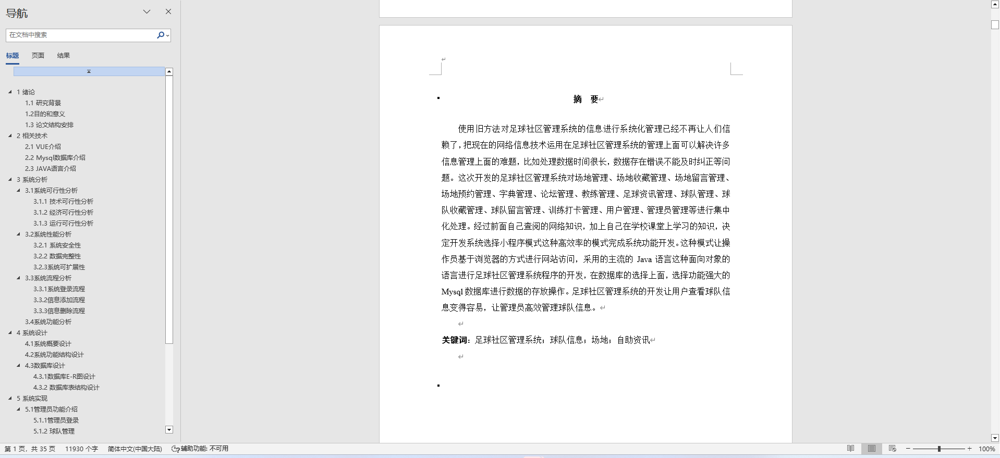
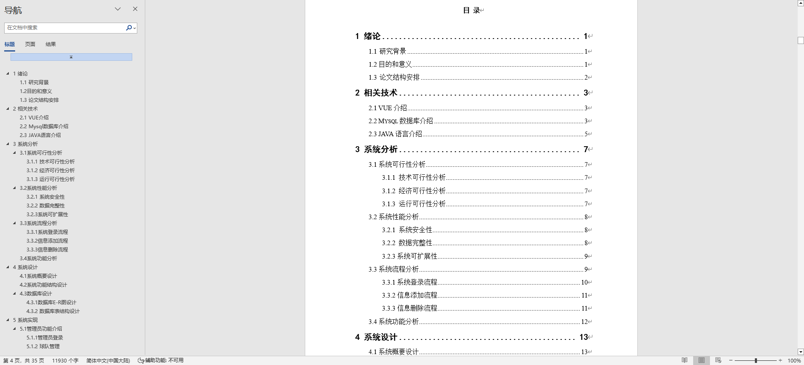

### 程序截图：
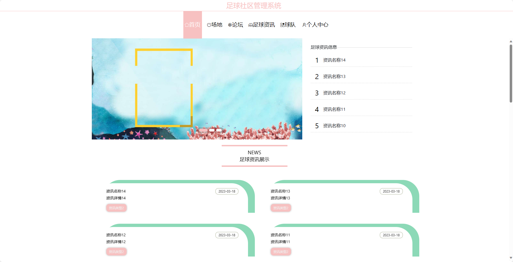
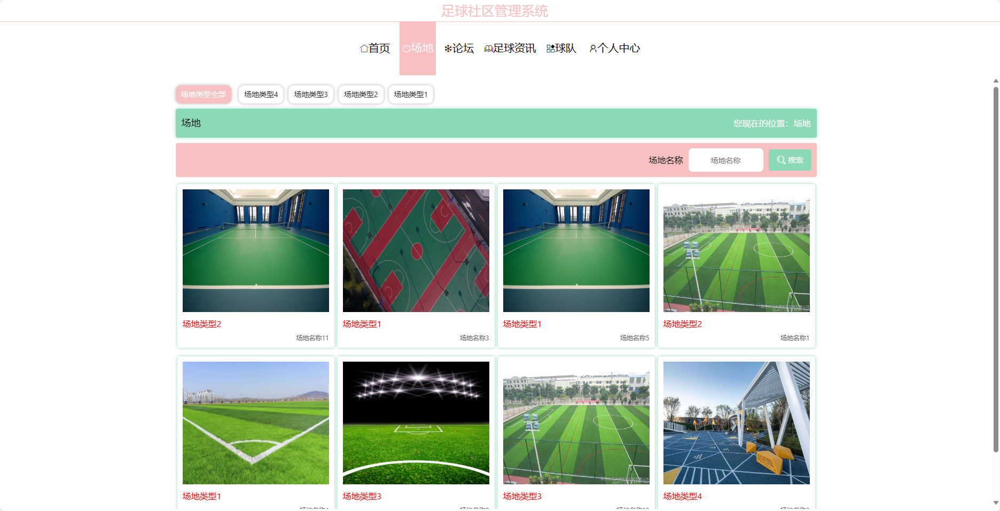
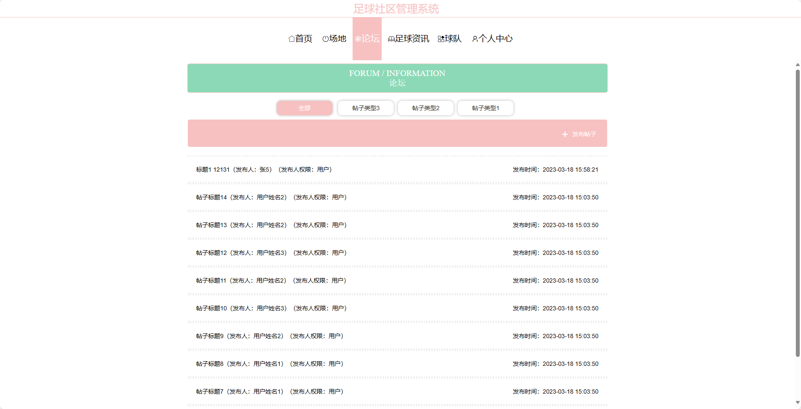
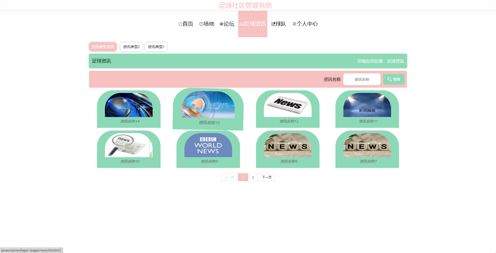

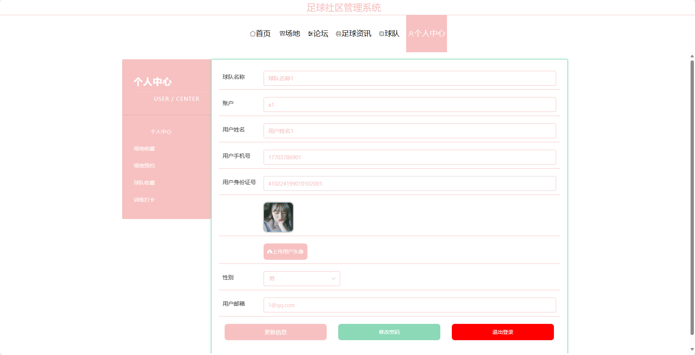
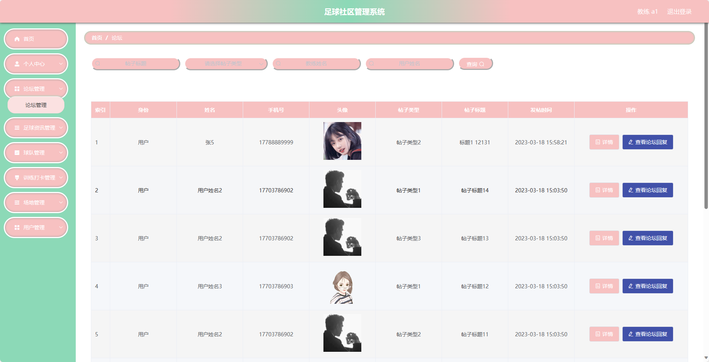
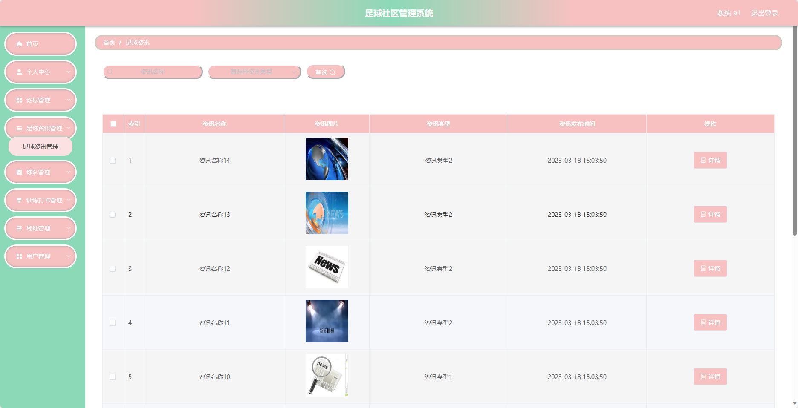
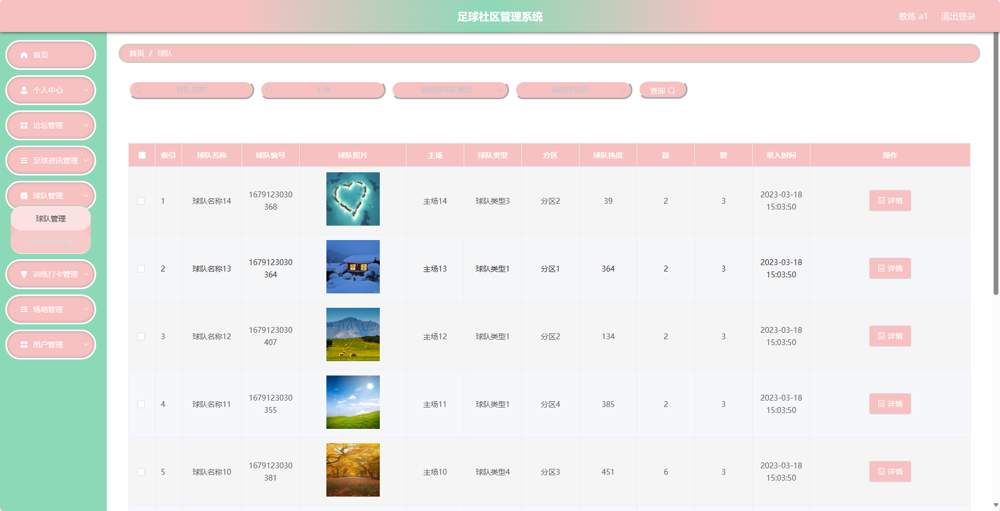
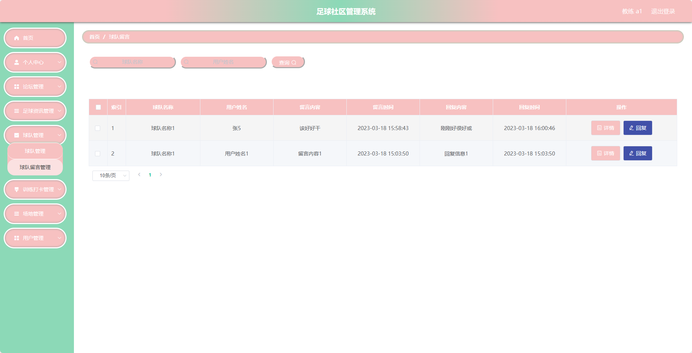

